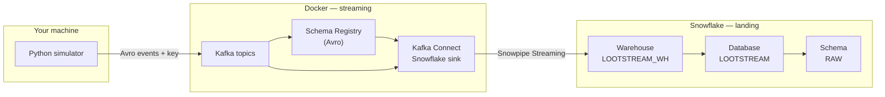
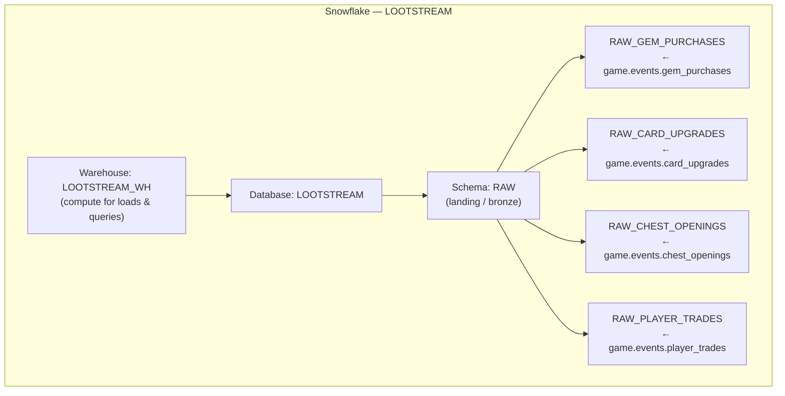

# LootStream

LootStream is a small project that simulates game player activity and streams those events in real time.
It is built as a learning/demo setup to show how game events can be generated and sent through a local pipeline.

## Data architecture

Diagrams use [Mermaid](https://mermaid.js.org/). They render on GitHub when you view this README. For a **pan/zoom/edit** view, copy the code block into [Mermaid Live Editor](https://mermaid.live).

### End-to-end pipeline



### Warehouse and bronze tables

Events land in **one database**, **one schema** (raw/bronze), and **four tables** — one per Kafka topic. Failed records can be routed to the DLQ topic `game.events.dlq` (see connector config).



### Topic → table map

| Kafka topic | Snowflake table |
|-------------|-----------------|
| `game.events.gem_purchases` | `LOOTSTREAM.RAW.RAW_GEM_PURCHASES` |
| `game.events.card_upgrades` | `LOOTSTREAM.RAW.RAW_CARD_UPGRADES` |
| `game.events.chest_openings` | `LOOTSTREAM.RAW.RAW_CHEST_OPENINGS` |
| `game.events.player_trades` | `LOOTSTREAM.RAW.RAW_PLAYER_TRADES` |

## What each file does (one line each)

- `docker/docker-compose.yml` - Starts local services including Kafka, Schema Registry, and Kafka Connect.
- `connect/Dockerfile` - Builds a Kafka Connect image with the Snowflake connector installed.
- `connect/snowflake-connector.json` - Template config used to deploy the Snowflake sink connector.
- `connect/keys/rsa_key.p8` - Local Snowflake private key file used by the deploy script.
- `simulator/__init__.py` - Marks `simulator` as a Python package.
- `simulator/config.py` - Loads app settings from environment variables.
- `simulator/models/__init__.py` - Marks `models` as a Python package.
- `simulator/models/player.py` - Defines the player model and creates sample players.
- `simulator/models/events.py` - Defines the event models used by the simulator.
- `simulator/models/economy.py` - Stores game economy data like cards, chests, and prices.
- `simulator/generators/__init__.py` - Marks `generators` as a Python package.
- `simulator/generators/player_generator.py` - Creates a pool of players for the simulation.
- `simulator/generators/gem_purchase_generator.py` - Generates gem purchase events.
- `simulator/generators/card_upgrade_generator.py` - Generates card upgrade events.
- `simulator/generators/chest_opening_generator.py` - Generates chest opening events.
- `simulator/generators/trade_generator.py` - Generates player trade events.
- `simulator/producer.py` - Sends generated events to Kafka.
- `simulator/main.py` - Runs the simulator from the command line.
- `schemas/gem_purchase.avsc` - Schema for gem purchase events.
- `schemas/card_upgrade.avsc` - Schema for card upgrade events.
- `schemas/chest_opening.avsc` - Schema for chest opening events.
- `schemas/player_trade.avsc` - Schema for player trade events.
- `scripts/create_topics.sh` - Creates required Kafka topics.
- `scripts/deploy-connector.sh` - Deploys/updates the Snowflake connector via Kafka Connect REST API.
- `scripts/connector-status.sh` - Shows connector status and related consumer lag.
- `requirements.txt` - Lists Python dependencies.
- `.env` - Contains local runtime and Snowflake connector settings.
- `.gitignore` - Lists files/folders Git should ignore.
- `README.md` - Project overview and quick file guide.

## Phase 2 smoke test

```bash
# 1. Copy your private key into the connect/keys directory
mkdir -p connect/keys
cp ~/lootstream/keys/rsa_key.p8 connect/keys/

# 2. Start all services (including Kafka Connect)
cd docker && docker compose up -d --build

# 3. Wait for Kafka Connect to be ready (takes ~60 seconds)
echo "Waiting for Kafka Connect..."
while ! curl -s http://localhost:8083/connectors > /dev/null 2>&1; do sleep 5; done
echo "Kafka Connect is ready"

# 4. Create topics (if not already created)
cd ..
bash scripts/create_topics.sh

# 5. Deploy the Snowflake connector
bash scripts/deploy-connector.sh

# 6. Check connector status
bash scripts/connector-status.sh

# 7. Start the simulator
python -m simulator.main --players 1000 --eps 50

# 8. Check Snowflake (in Snowsight worksheet):
# SELECT COUNT(*) FROM LOOTSTREAM.RAW.RAW_GEM_PURCHASES;
```
