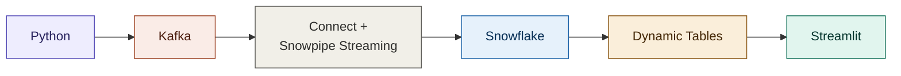
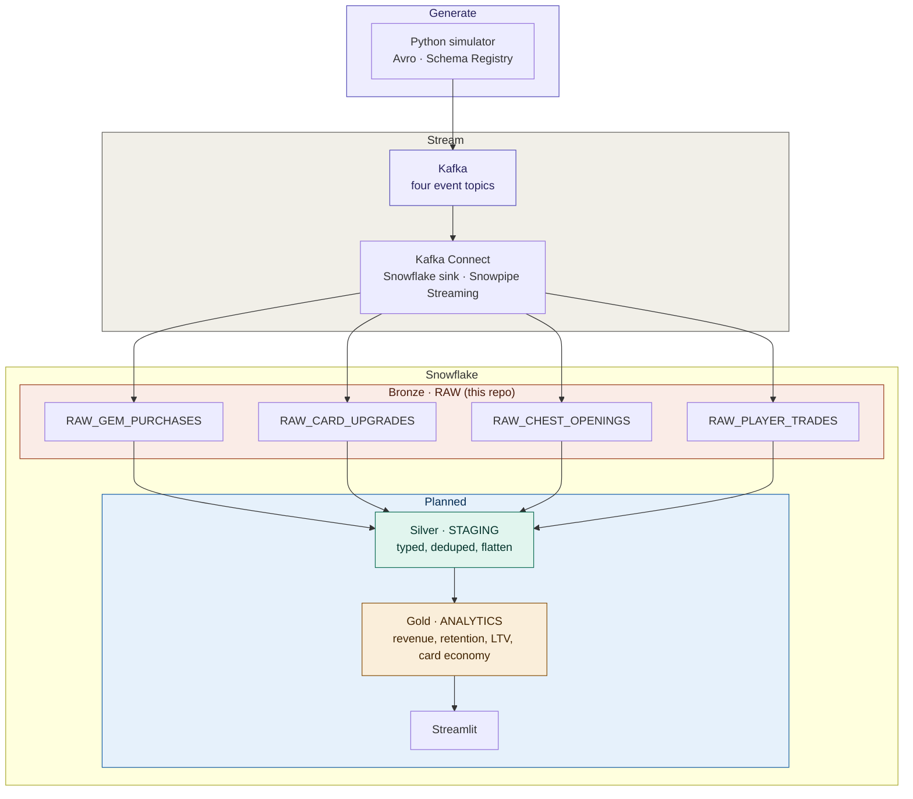
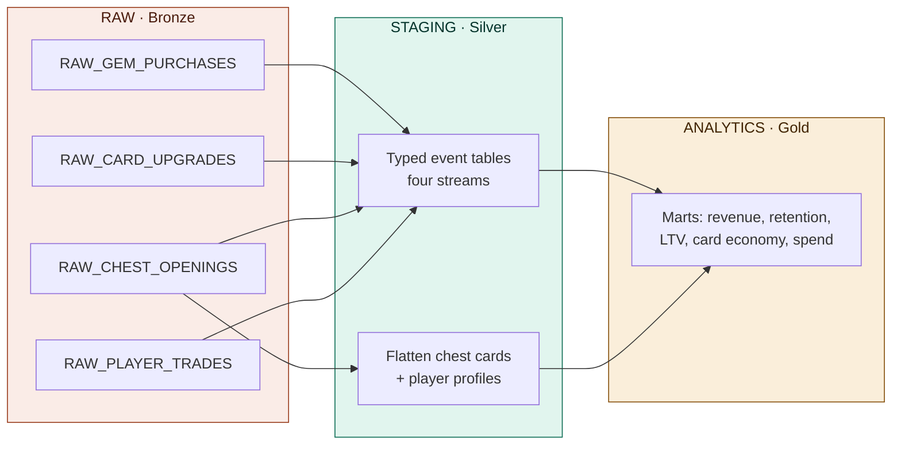

# LootStream

Synthetic game economy events are generated in Python, written to Kafka as Avro, and streamed into Snowflake landing tables via Kafka Connect (Snowpipe Streaming). Docker runs Kafka, Schema Registry, and Connect locally.

## Architecture

Mermaid renders on GitHub; paste any block into [mermaid.live](https://mermaid.live) to edit. This repo implements the simulator, Kafka, Connect, and **bronze** (`RAW_*`) landing. Silver, gold, and Streamlit are the target warehouse shape.

### Tech stack



### End-to-end pipeline

Kafka topics: `game.events.gem_purchases`, `game.events.card_upgrades`, `game.events.chest_openings`, `game.events.player_trades`.



### Snowflake warehouse layers



## Layout

| Path | Purpose |
|------|---------|
| `docker/` | Compose stack: Zookeeper, Kafka, Schema Registry, Kafka Connect, optional UI |
| `simulator/` | Event models, generators, Avro producer, CLI entrypoint |
| `schemas/` | Avro definitions for the four event types |
| `connect/` | Connect image Dockerfile, Snowflake connector JSON template, `keys/` for RSA private key (gitignored) |
| `scripts/` | `create_topics.sh`, `deploy-connector.sh`, `connector-status.sh` |

## Quick start

**Stack and topics**

```bash
cd docker && docker compose up -d --build
cd .. && bash scripts/create_topics.sh
```

**Simulator only** (needs Kafka + Schema Registry up)

```bash
pip install -r requirements.txt
python -m simulator.main --players 1000 --eps 50
```

**Snowflake sink** — place `rsa_key.p8` in `connect/keys/`, set `.env`, wait for Connect on port 8083, then:

```bash
bash scripts/deploy-connector.sh
bash scripts/connector-status.sh
```

**Verify in Snowflake**

```sql
SELECT COUNT(*) FROM LOOTSTREAM.RAW.RAW_GEM_PURCHASES;
```
